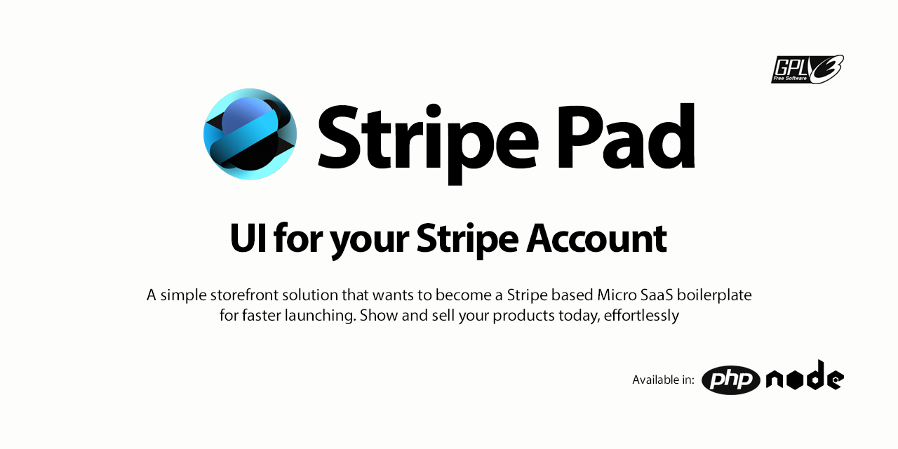
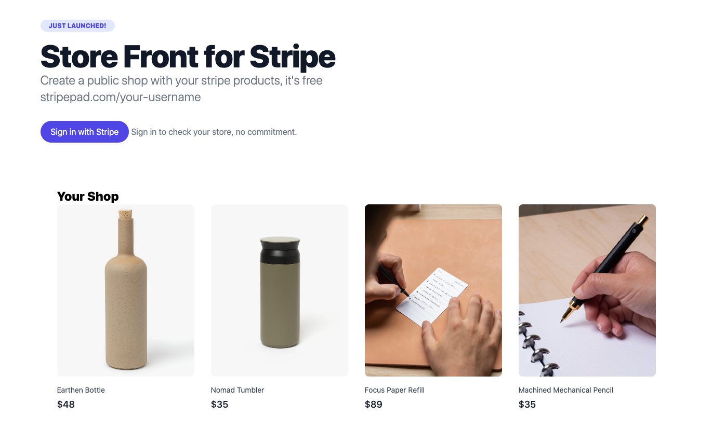
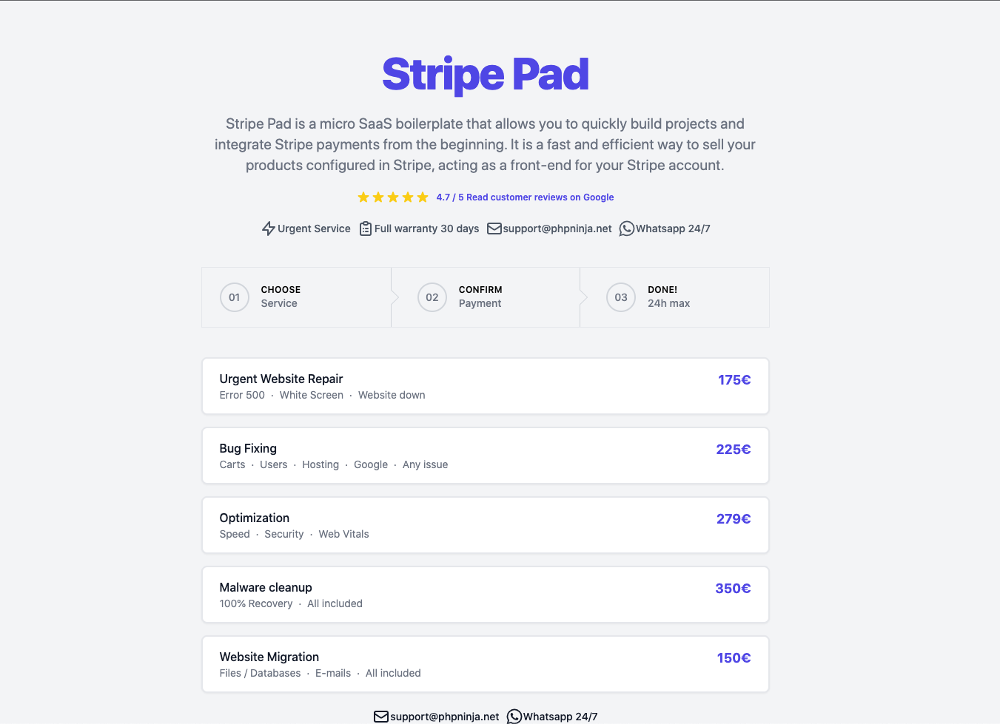

#  Stripe Pad

Stripe Pad is a fast and efficient way to sell your products configured in Stripe, acting as a front-end for your Stripe account. 





## Getting Started

To get started with Stripe Pad, follow these steps:

```
  git clone https://github.com/natzar/stripe-pad.git
  cd stripe-pad
  composer install
```

Open localhost/stripe-pad from your browser. In the first run, your account details and products from your Stripe Account will be gathered and saved in /cache/data.json


## Main components

### Config.php
General settings, base urls, stripe credentials

### Cache
Data gathered from Stripe is stored in cache/data.json. In case you want to clean cache, just remove the file.

### Main controller Index.php
It includes the theme files defined in config.php, in case cache folder is empty,  it retrieves data from webhooks/stripeGetDetails.php and store the json in cache/data.json

### Themes
The html/css for the landing that will showcase your offerings.
Inside /themes folder.
$stripeData array is passed to all themes, 

#### $stripeData
StripeData is the array to make data from Stripe available to theme files.

##### $stripeData['account']
Account details depends on your settings and type of Stripe account
##### $stripeData['products']
It contains all data related to your products

### Webhooks
#### stripeGetDetails.php
This file is called by index.php when cache/data.json is not found

#### stripeNotifications.php
Manage notifications from Stripe after setting up a new webhook in your Stripe account. Payment received, subscription creation, invoice paid, ...


Usage & Customization

- Add a webhook https://dashboard.stripe.com/webhooks

Once your Stripe account is configured, you can easily retrieve products and other details from your Stripe Account. The boilerplate also includes basic checkout functionality and a sample thank-you page.

You can also customize the look and feel of the front-end as per your need.

- Clone one of the 2 basic themes inside *themes* folder.
- Basic themes include Tailwind via CDN, no other CSS or JS


## Dependencies
Dependencies are managed via composer

- Stripe Php Wrapper
- Php Mailer


## Roadmap
Road to a micro saas boilerplate based in Stripe, to launch and validate new ideas fast:

- User management
- Transactional Emails
- Admin Private Area (user & payments management)
- User Private Area (after successful signup & login)
- Nodejs webhooks


## Contributing

Any contributions to Stripe Pad are welcomed. If you have any ideas or suggestions for new features, please feel free to open an issue or submit a pull request.
- New core features
- Add a new theme
- Add a new plugin

## License

Stripe Pad is open-sourced software licensed under the GPL-3.0 license.
Project URL: [www.stripepad.com](https://www.stripepad.com)

## Disclaimer

> Not affiliated in any way with Stripe.com

## Contact 

If you have any questions or need support, please don't hesitate to reach me on Twitter [@betoayesa](https://www.twitter.com/betoayesa)

Thank you for using Stripe Pad!
